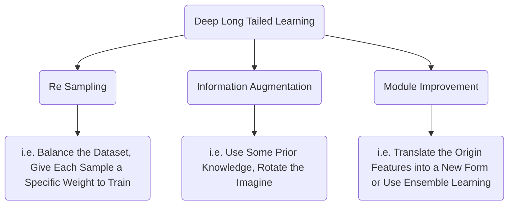

# I. [A Survey about Deep Long Tailed Learning](https://arxiv.org/pdf/2110.04596.pdf)
## Re Sampling
* * *
### Class Rebalance
Change the origin samples into a new set which decrease the degree of long tailed. 
### Class Sensitive Learning
Make the loss function can adapt different classes. i.e. the loss weight increased when the sample belongs to a class which have few samples or the margin changed when facing samples from different classes.
### Logit Adjustment
Adjust the log loss function. i.e. cross entropy loss function
* * *
## Information Augmentation
* * *
### Transfer Learning
Using some knowledge or models which already exist.
### Data Augmentation
- Rotate
- Flip
- ranslate
* * *
## Module Improvement
* * *
- Representation Learning : Translate original data into a new data which can represent its features more precisely 
- Ensemble Learning
***

* * *
# II. [Learning to Re-weight Examples with Optimal Transport for Imbalanced Classification](https://arxiv.org/pdf/2208.02951.pdf)
## Main Idea
We have two types of datasets, one is called training set while the other is called meta set. Samples in the training data follows the long-tailed distribution and every sample in it has different weight. On the contrary, samples in meta set is class balance and every sample has the same weight. Our goal is to train the weight and use the weight to construct a specific loss function to train a better classifier.
* * *
## Workflow
We have basic loss function for each sample $\ell (y, f(x;\theta ))$
1. Update $\theta$ through training set and $L1 = \Sigma \ell (y_{train}, f(x_{train};\theta ))$ for $t_1$ iterations.
2. Update $\theta$ and $\omega$ for $t_2$ iterations as followed:
- Sample a mini batch $B$ from training set
- Update $\theta$ through training set and $L1 = \Sigma_{B} \omega_i \ell (y_{i}, f(x_{i};\theta ))$
- Update $\omega$ through OT
- Update $\theta$ through new $\omega$
* * *
# III. [Balanced MSE for Imbalanced Visual Regression](https://arxiv.org/pdf/2203.16427.pdf)
## Main Idea
Balanced MSE use the thought of MSE to propose a new loss function. This method did some hypothesis and definitions. Besides, it is important to comprehend the origin thought and the derivation of MSE, or you cannot comprehend this algorithm.

**i.e,**
- the training set is unbalanced while the test set is balanced (they are all infinite set)
- the joint distribution of x, y on train set and test set is equal
- $p_{bal}(y|x;\theta)$ follows the gaussian distribution.
## Loss Function
$L = -log\frac{exp{(-||y_{pred}-y||_2^2/\tau)}}{ {\textstyle \sum_{y'\subseteq B_y}^{}} exp{(-||y_{pred}-y'||_2^2/\tau)}}$
***
# IV. [CUDA: Curriculum of Data Augmentation for Long-Tailed Recognition](https://openreview.net/pdf?id=RgUPdudkWlN)
## Main Idea
Using data augmentation methods to improve the classification accuracy. 

Besides, the thought of Data Augmentation derives from these hypothesis and observation.

- **Diversity Hypothesis and Data Scarcity:** More rich training set can help to improve model's generalization ability while Data Augmentation can be used to generate more different sets through existing sets.
- **Robust Observation :** It has been observed that Data Augmentation can make the model more robust to deal with some sets with noises and distortion.
***
## Workflow
- **In each epoch :**
	1. Calculate the new number of augmentation times $L_c$ for each class.
	2. For each sample, if the random number is larger than augmentation probability, augment it $L_c$ times to construct a new training set.
	3. Use long tail classification algorithm to train the model. 

- **Methods to Calculate $L_c$:**
	 1. For $i$ in $0-Lc$, use random sample to construct a new set with $L_c$ samples and then calculate the accuracy of classification. If the accuracy is larger than the threshold, $L_c = L_{c_{former}}+1$.
	 2. Else $L_c = L_{c_{former}}-1$
* * *
# V. [Tailoring Self-Supervision for Supervised Learning](https://www.ecva.net/papers/eccv_2022/papers_ECCV/papers/136850342.pdf)
## Main Idea
Two Rotation Strategy
- LoRot-I : Use a fix-sized window to randomly select an area, then rotate the selected area 90 degrees.
- LoRot-E : Separate a photo into many cells and then randomly choose an area to rotate 90 degrees.
***
## Affinity
$Affinity = \frac{A(m, D'_{val})}{A(m, D_{val})}$

Affinity can be used to evaluate the degree of data distribution shift.
* * *
