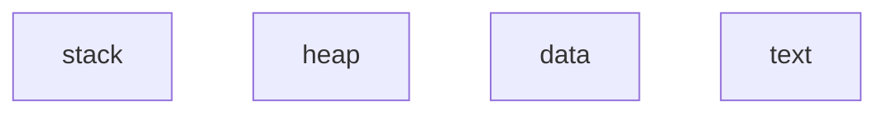
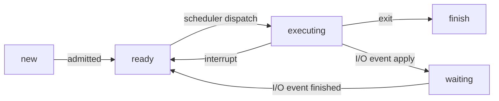
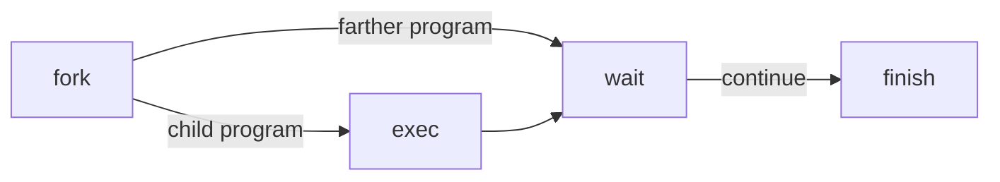

# Chapter 1: Introduction

## Definition of OS
- **Users View :** Easy to use, Resource Utilization
- **System View :** Resource Allocator
***
## Interrupt
- **Trap :** Hardware can trigger it anytime by bus.
- **System call or monitor call :** Software can trigger it by executing special operation.
* * *
## Modes
- **User mode :** mode bit = 1
- **Kernel mode :** mode bit = 0
Tips : some instructions can only executed in kernel mode while the OS ask system call to use API functions to access kernel space.
***

# Chapter 2 : Operation System Structures

## Operation System Service
- UI
- Program Execution
- I/O operations
- File System Manipulation
- Communication
- Error Detection
- Resource Allocation
- Accounting
- Protection and Security
***
## Interface -- Command Line + Command Interpreter

**<font color=IndianRed>Two types of command interpreter</font>**

<font color=IndianRed>

- **The command interpreter itself contains the code to execute the command**
- **The command interpreter only load the file into the memory and execute it**

</font>

***
## System Calls

**<font color=IndianRed>A software want to access the kernel space, the OS give an API to it and the API access the kernel space. As a result, system call can be also viewed as an connection between software and kernel.</font>**

***
## Operating System Structure

<font color=IndianRed>

- **Layered Structure : ① Easy to construct and debug ②A layer can only use lower layers ③Less efficient**
- **Micro Kernels : ①Easy to extend ②More reliable and secure ③Frequently use of message function (Increase communication between user space and kernel space)**
- **Modules : Flexible (can call any other modules) and Efficient (don't invoke message passing)**

</font>

***
# Chapter 3 : Processes

## Process In Memory


- Stack is used to store temporary data
- Heap is used to store memory allocated to this process
- data is used to store global variables
- text is used to store code
***
## Process State
**<font color=IndianRed>IMPORTANT</font>**

***
## PCB
**<font color=IndianRed>Process control unit is a component used to record the information of a specific process.</font>**
***
## Scheduler
<font color=IndianRed>

- **Long Term Scheduler (Job Scheduler) : From disk to memory**
- **Middle Term Scheduler (Swapping) : push back to memory and then push in, in order to reduce multiprogramming**
- **Short Term Scheduler (CPU Scheduler) : From memory to CPU**

</font>

***
## Context Switch
**<font color=IndianRed>Context switch means the OS record the old process PCB and load a new process through its PCB, context switch time is pure overhead. </font>**
***
## Fork()&Exec()
**<font color=IndianRed>IMPORTANT</font>**

fork can set two process
- the return value is 0 in child process
- the return value is child process id in farther process

***
## Inter Process Communication
<font color=IndianRed>

- **Messaging Passing**
	**1. Direct or Indirect**
	**2. Synchronize or Asynchronize**
	**3. Zero Capacity or Bounded Capacity or Unbounded Capacity**
- **Shared memory**
	 **Bounded Buffer or Unbounded Buffer
	when in == out the buffer is empty
	when in == (out-1)%size the buffer is full**

</font>

***
# Chapter 4 : Threads

## Overview
A thread comprise a **thread ID**, a **program counter**, a **register set** and a **stack**.
**Code**, **data** and **files** are shared among various threads which belong to the same process. Each threads has its own **stack** and **register**.
***
## Benefits of Using Threads
- Responsiveness
- Resource Sharing
- Economy
- Increase Concurrency
***
## Multithreads Models
Users threads are managed without kernel support while kernel threads are supported and managed directly by the operation system.
<font color=IndianRed>
**There are roughly four types of threads models**
- **Many to one**
- **One to one**
- **Many to many**
- **Two level model**

</font>

***
## Thread Library
Provide the programmer an API to create and manage threads.

***
# Chapter 5 : CPU Scheduling

## evaluation criteria
<font color=IndianRed>

- **CPU Utilization**
- **Throughput :** The number of processes which can be completed per time unit
- **Turnaround Time :** The time of submission the process to the time of completion
- **Waiting Time :** Total wait time between the time of submission the process to the time of completion
- **Response Time :** The time of submission the process to the time of first response
***

</font>

## Scheduling Algorithm
<font color=IndianRed>

**1. First Come First Serve : Nonpreemptive
2. Shortest Job First : Nonpreemptive or Preemptive
3. Priority : Might cause indefinite blocking or starvation and aging can avoid it.
4. Round Robin
5. Multilevel Feedback Queue**

</font>
Gantt chart
Starvation
time slice

***

# Chapter 6 : Process Synchronization

## The Critical Section Problem
Three requirement
1. Mutual Exclusive
2. Progress
3. Bounded waiting
***
## Peterson's Algorithm
1.	Raise your hand first and give up your position to others.
2.	When others hand down and its your turn, execute.
3.	Hand down.
***
## Synchronization Hardware
1.	Start waiting and hold a key
2.	Sry to open through the key until the door opened or waiting stop
3.	Execute
4.	Find next waiting process and stop its waiting
***
## Semaphore
The disadvantage of primary semaphore (spinlock) is **busy waiting**.
***
## Monitor
Only one process at a time can be activate within the monitor.
```cpp
1	condition x, y;
2	x.wait();
3	x.signal();
```

***
# Chapter 7 : Deadlock
## Necessary Conditions
<font color=IndianRed>

**1.	Mutual Exclusive
2.	Hold and wait
3.	No preemption
4.	Circular wait**

</font>

***
## Deadlock Prevention
Ensure one of the necessary conditions cannot happen.
***
## Deadlock Avoidance
<font color=IndianRed>

 **1.	Banker's Algorithm**
- **Safety Algorithm :** Initialize work = available and finish = false 
- **Resource Request Algorithm :** if request is less than need and available, try to allocate the request, if it turns into a safe state, the request can be accepted.

**2.	Resource Allocation Graph Algorithm**
- **Request edge**
- **Every resource has only one example**

</font>

***
## Deadlock Detection
**1.	Wait for Graph
2.	Detection Algorithm (Similar to safety algorithm)**
***
## Methods to Recover from Deadlock
- Abort all deadlock process
- Abort one process at a time until the deadlock cycle is eliminated.
***
# Chapter 8 : Memory
## Logical and Physical Address
<font color=IndianRed>

Logical address is always generated by CPU, **logical address** add the value in **relocation register** is equal to **physical address**

</font>

***
## Memory Allocation
- Methods : first-fit, best-fit, worst-fit
***
## Paging
No outer fragmentation while have inner fragmentation.

This method use **TLB** to accelerate and try to improve the **hit rate**.
***
## Segmentation

***
# Chapter 9 : Virtual Memory
## Algorithm to Deal with Page Fault
- First in first out
- Optimal 
- Least recently used
***
## Methods to Deal with Trashing
- Working Set Model
- Page Fault Model
***
# Chapter 10 : File System Interface
## File Access
- Sequential Access
- Direct Access
- Index Access
***
## Directory Structure
- Single Level Directory
- Two Level Directory
- Tree Structure Directory
***
# Chapter 11 : File System Implementation
## File System Organized Layers

***
## Allocation Methods
- Contiguous allocation
- Linked allocation
- Index alloation
***
## Free Space Management
- Bit Vector
- Linked List
- Grouping
***
# Chapter 12 : Mass-Storage Systems
## Basic Terms
spindle, track, sector, platter, disk arm, read-write head
***
## Disk Scheduling
- FCFS : First Come First Served
- SSTF : Shortest Seek Time First
- SCAN
- C-SCAN
- LOOK
- C-LOOK
***
## RAID Structure
***
# Chapter 13 : I/O Systems
Polling
Interrupt
DMA


address binding
swapping
memory mapping and protection
memory allocation
fragmentation

effective access time
